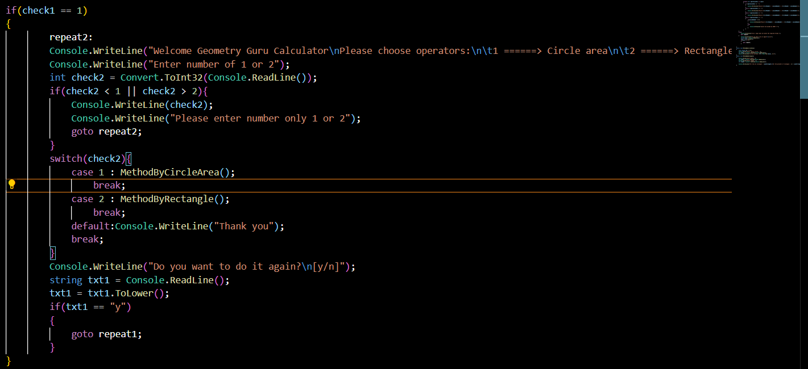
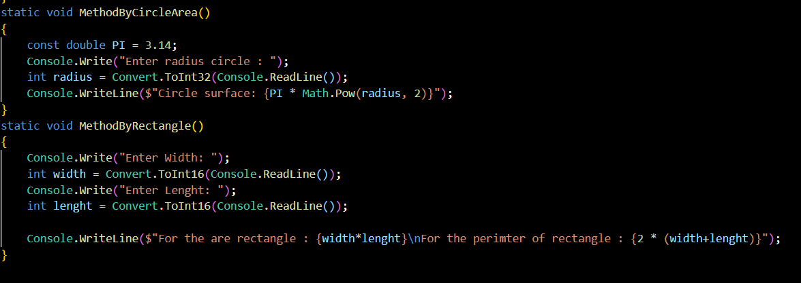
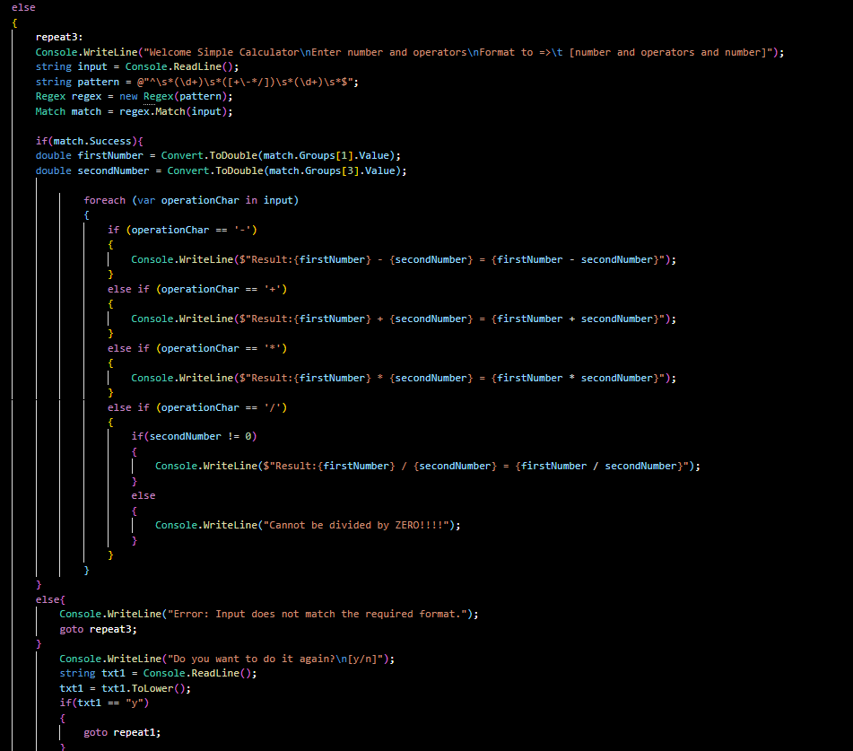

# BasicCalculator
## Basic Calculatorda ishlatildi
>
> # Shart 
    1. Geometry Guru:
  1. Aylana yuzasini hisoblash (Pi * R^2)
  2. Mustaqil izlanib, qiziq muammoni hal qiling

2. Simple Calculator
  1. +, -, *, /, ^ Input: 2^2, Output: 4
  2. Murakkab algebraik amallar orqali qiziq muammoni hal qiling

Qabul qilish shartlari:
1. Minimum: 3 Commit
2. README file formatlangan holda, screenshot va gif (demo)
3. Repo ortiqcha (ex. bin, obj, etc.) fayllar bo'lishi
 mumkin emas

>
1.Input

2.Choose Calculator

3.Method By Geometry Guru

4.Simple Calculator
